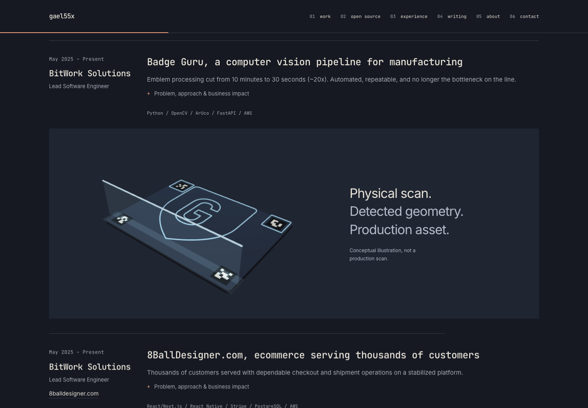
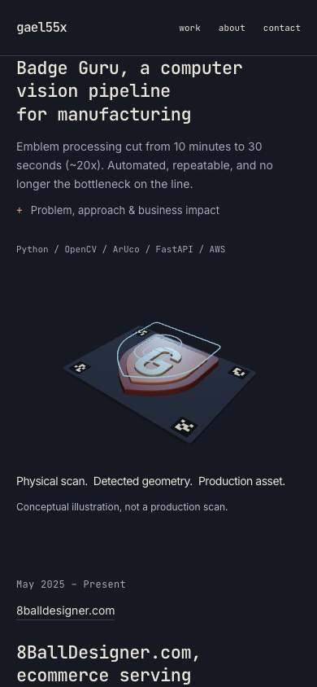
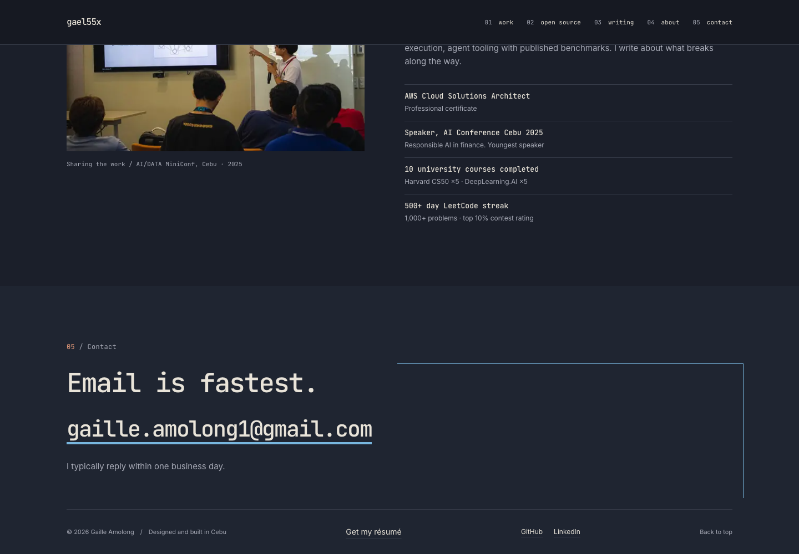
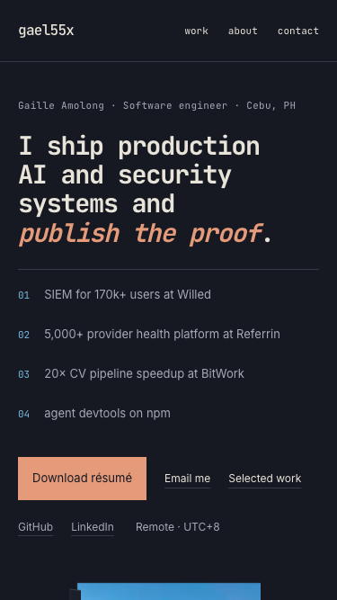
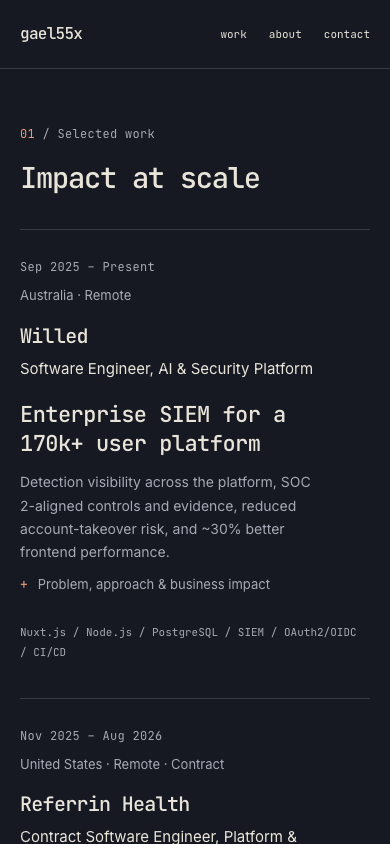

# Fable 3D and scroll-motion revision

Base: `875ab8b` on `main`, the merge of PR #10. The owner rejected the earlier
3D treatment and explicitly asked Fable 5.1 to revise it. The prior redesign
reports describe that earlier handoff; their design-readiness verdict does not
establish acceptance of this revision.

## Audit and decision

Fresh desktop/mobile screenshots and hover states showed these material issues:

| Priority | Evidence                                                     | Root cause                                              | Revision                                                                            |
| -------- | ------------------------------------------------------------ | ------------------------------------------------------- | ----------------------------------------------------------------------------------- |
| P1       | Rest and hover look nearly identical                         | Whole-group tilt substitutes for choreography           | Finite scan, detection and lift sequence on hover                                   |
| P1       | Small pastel board, wire torus and coin inside a large panel | Arbitrary primitives, distant framing and flat lighting | Close scan bed, beveled relief emblem, marker tags and contact shadows              |
| P1       | Nothing visibly scans or becomes usable geometry             | The diagram does not demonstrate the project's domain   | A clipping plane replaces the relief with matching contours as a light sheet passes |
| P2       | Scene disappears immediately on mouse leave                  | GPU lifetime and visual exit are the same event         | 450ms retract before disposal; smooth replay through rest                           |
| P2       | Redundant heading, eyebrow and interaction instructions      | Copy explains controls rather than supporting the scene | Three short stage phrases and one conceptual-illustration note                      |
| P2       | Motion mostly affects headings and one study                 | No consistent progression through the page              | Fully visible heading/content entrances across every major section                  |

Fable independently compared a scan sweep, exploded assembly, and marker
rectification. It selected the scan sweep: it communicates the computer-vision
workflow and offers a visible transformation. Exploded assembly would repeat the
old stack metaphor; camera-only rectification would flatten the endpoint.

Fable authored the replacement geometry, lighting, timeline and component proposal
through the owner's approved Claude subscription integration. Implementation review
retained its concept and corrected camera framing, resource cleanup, motion-preference
changes, replay resets, and repeated geometry disposal. Fable’s next review found no P0/P1 and scored identity 8 and engineering 8.5,
but held composition/motion at 7.5 because the source competed with the output.
The final source-dimming pass implements its recommended correction.

Touch remains deliberately
activated by tap; Fable's proposed scroll autoplay was rejected to preserve the
existing opt-in GPU behavior.

## Visual and motion specification

- Slate scan bed, clay relief shield, cream G monogram and dusk-blue detected contours.
  Four conceptual marker patterns ground the scan; they are not real ArUco IDs.
- Warm key, cool rim, beveled geometry, one 1024px shadow map and ACES tone mapping.
- **0–0.25s:** scanner enters; the camera begins a small move.
- **0.25–1.65s:** the sheet sweeps across the emblem, clipping the physical form
  and revealing its corresponding contours. Marker frames register as it passes.
- **1.7–2.5s:** detected geometry lifts while the physical emblem returns below.
- **2.7s:** the sequence settles. Pointer movement still eases the viewing angle;
  rendering stops when the view settles.
- **Exit:** the geometry retracts over 450ms, then holds without rendering for a
  1.5s grace period so a quick re-entry can reuse the renderer. Replay and rapid re-entry pass through
  rest instead of hard-resetting the camera or meshes.
- **Touch/keyboard:** tap, Enter or Space starts/replays the sequence. Touch scrolling
  does not start it. No drag interaction or scroll interception.
- **Reduced motion:** hover stays static; deliberate activation shows the fixed
  endpoint without an animation. Changing the preference releases the active scene.

The G outline comes from the original JetBrains Mono Bold typeface, rather than a
generic symbol. Its license is retained in `jetbrains-mono-OFL.txt`. Marker frames
recede after detection; only the outer contour and G remain in the lifted view.

As the contours lift, the physical source dims toward the bed tone. Retraction
restores its original colors. This makes the two overlapping stages read as source
and output instead of two equally prominent shapes.

The stage caption follows the three beats without changing layout or adding copy.
The static poster is rendered from the exact same resting geometry and camera.
Loading and failed WebGL retain the poster. All explanatory content stays HTML.

### Motion through the page

Hero portrait depth, proof entries, work summaries/dividers, public tools,
experience rows, writing rows, About and contact use native CSS scroll timelines.
Headings lead with 24px entrances; content follows with 28px entrances. Text is
fully opaque throughout. The speaking image moves a small distance within a clipped
frame. The portrait's wire frame and clay block separate independently on hover,
echoing the vector lift. Native disclosure transitions and reading progress remain.

Unsupported browsers keep the static layout and native disclosures. Reduced motion
disables every CSS effect. No scroll listener, animation framework or new runtime
dependency was added.

## Engineering review

The React island owns activation, readable state and browser lifecycle events.
The Three module owns geometry, clipping, finite animation and GPU resources.
Imperative code is confined to those stateful side effects. It schedules at most
one animation frame, clamps negative frame deltas, cancels replay on disposal,
and releases shared geometries once. Leaving the viewport, hiding the document,
context loss and component unmount also release the GPU.

The shadow map and finite sequence cost more during deliberate interaction than
the old tilt-only scene. They provide contact, depth and an actual transformation.
DPR remains capped at 1.5; there are no external models, downloaded textures,
post-processing passes, continuous idle animation or automatic mobile activation.
Three.js remains dynamically imported. Initial JavaScript remains about 110kB; the optional scene chunks total 144KiB gzip
(previously about 135KiB). There are no new runtime dependencies.

## Validation and evidence

- `npm run test:scene`: controlled timestamps exercise scan progression, contour
  lift, finite settling, continuous pointer input, retract/re-entry, reduced-motion
  endpoint and shared-resource disposal using the real Three geometry.
- Production Playwright: eight widths from 320px to 1920px, first-screen actions,
  keyboard navigation, all disclosures/anchors, no-JS reading, 200% text, overflow,
  axe A/AA, loading/failure fallbacks, real canvas changes, idle frame counts,
  touch replay and live motion-preference changes.
- Lint, Prettier, production build, Knip, Snapline, dependency audit and full diff
  review pass. Knip and Snapline report zero issues; npm reports zero vulnerabilities.
- `npm run render:study` regenerates the poster and rest/scan/end frames from the
  production scene with local browser routing. No development route ships.

### Scene-revision performance snapshot

Local mobile Lighthouse on the final production build: **98 performance / 100
accessibility / 100 best practices / 100 SEO**. LCP **2.4s**, TBT **20ms**, CLS **0**.
The preceding run scored 98 with LCP 2.2s and TBT 120ms; lab timing varies. No field
Core Web Vitals or physical mobile GPU measurements are claimed.

## Limits

The model is a conceptual workflow illustration, not a production result or an
accuracy claim. Employer metrics and original copy are unchanged. The résumé/site
Referrin date discrepancy and externally blocked profile checks remain as described
in the original validation report. Browser emulation and lab performance do not
certify physical mobile GPUs, screen readers or field Core Web Vitals.

## Follow-up: Apple-inspired art direction

The owner asked to push the complete page further and explicitly referenced Apple's
design principles. Fable reviewed original and current desktop/mobile captures,
then refined the plan against clarity, hierarchy, consistency and purposeful motion.
The guiding references are Apple's [Layout](https://developer.apple.com/design/human-interface-guidelines/layout)
and [Motion](https://developer.apple.com/design/human-interface-guidelines/motion) guidance.
This applies those principles to the existing identity; it does not copy Apple branding.

### Findings and changes

| Priority | Finding                                                                            | Implemented correction                                                                                      |
| -------- | ---------------------------------------------------------------------------------- | ----------------------------------------------------------------------------------------------------------- |
| P1       | BitWork employer/role appeared twice in Work and again in Experience               | One employer group with two projects; employment dates, location and promotion history live beside the work |
| P1       | Study box interrupted the metadata grid and separated the spatial objects visually | Transparent poster and canvas; scan bed sits directly on the page, aligned with the project content         |
| P1       | Work, Experience and Writing repeated the same long ruled structure                | Folded employment into Work; five numbered sections; mobile uses space within each employer group           |
| P2       | Portrait had lost presence relative to the original                                | Wider portrait, closer framing elements and one shallow base plane; no grid or animation framework          |
| P2       | Large tool/company labels competed with the actual work                            | Product titles outrank employers; public-tool names sit below section headings in scale                     |
| P2       | Email was visually secondary and footer broke the closing surface                  | Larger email, restrained open contour and one continuous contact/footer surface                             |

The same dusk outline connects the portrait, detected geometry and contact corner.
The clay accent and original fonts remain. There is no new visitor-facing explanation
or invented evidence. All four original project records were reconstructed from the
new employer/project data and compared with the committed records: descriptions,
claims, roles, dates and links match exactly. The fuller original contract role is
retained. The old `#experience` bookmark resolves to the combined work/history section.

The project data is an explicit nested structure in `data/selectedWork.js`, not a
runtime join by company-name strings. The duplicate experience dataset, old row CSS,
unused contact wrapper/styles and superseded color token were removed. The study
caption remains smaller than a case title so the narrow metadata column stays readable.

Motion marks section/group boundaries. Individual work paragraphs no longer enter
separately. The new contact contour draws on entry and is static under reduced motion.
The existing optional scan choreography is unchanged. A browser regression exposed
that pointer-enter can fire when scrolling moves the stage beneath a stationary mouse;
activation now starts on actual pointer movement, with a per-entry ref preventing
replay on every move. Tap and keyboard activation still work.

### Integration fixes and validation

The first rendered pass exposed a 1px laptop overflow from the projected portrait
base. Its extent was reduced at the source, rather than hiding overflow on the page.
A closed contact rectangle looked like an empty panel, so only its top/right contour
remains. A browser assertion checks the poster's alpha channel to prevent the static
background reappearing on future regenerations. The active canvas crossfades with
the poster; once ready the poster is hidden, preventing a doubled scan bed as the
camera moves. Failure and exit restore the poster immediately. This was caught
through rendered hover inspection and now has a browser regression assertion.

The first independent scene review scored that bounded revision 8/10. The subsequent
whole-page review identified composition and repetition as separate issues. Final
scores and the production validation results below refer to the integrated refinement.

### Final refinement and independent verdict

Fable's whole-page pass rated the result 8.8 and identified four P2 refinements.
The original italic phrase now stays together at ordinary sizes but remains able
to wrap with enlarged text. Secondary hero links wrap as one group. One responsive
display-size token keeps the closing heading subordinate to the bold hero.
Section order/labels/numbering and contact display/href now derive from shared data.

Fable independently confirmed these changes and the transparent-canvas handoff:
**9.0/10, ready to ship, no P0/P1 remaining**. The lead accepts that assessment;
10/10 is not claimed. These are design judgments, not measured hiring outcomes.

| Category                | Final score |
| ----------------------- | ----------- |
| First impression        | 9           |
| Employer friendliness   | 9           |
| Information hierarchy   | 9           |
| Visual design           | 9           |
| Typography              | 9           |
| Brand distinctiveness   | 9           |
| Project storytelling    | 9           |
| Engineering credibility | 9           |
| Mobile UX               | 9           |
| Accessibility           | 9           |
| Performance             | 9           |
| Motion design           | 9           |
| Maintainability         | 8.5         |

Residual P3: Header keeps the three mobile-primary ids locally; an unknown section
id fails at build time with an ordinary property error; the contact contour is
slightly more prominent on desktop. These do not affect the validated visitor paths.
The earlier résumé date discrepancy and the lack of physical-device/field-CWV
measurements remain. The model remains an explicitly conceptual artifact, and
employer outcomes remain self-reported.

### Final production validation

- Build, lint, Prettier and deterministic scene checks pass.
- Final Playwright run passes at 320, 390, 601, 768, 961, 1280, 1440 and 1920px:
  zero horizontal overflow and zero axe A/AA violations. Keyboard, all disclosures,
  anchors, PDF, metadata, no-JS, 200% text, reduced motion, normal/touch/keyboard 3D,
  replay, idle frame counts, context loss and unavailable-WebGL fallbacks pass.
- Stationary-pointer coverage explicitly parks the pointer where the stage lands
  before scrolling. Scrolling alone creates no canvas; ordinary hover still plays.
- Poster alpha is zero outside the object and its ready-state opacity is zero;
  both now have regression checks.
- Knip and Snapline report zero issues; npm audit reports zero vulnerabilities.
- Final local mobile Lighthouse: **96 performance / 100 accessibility / 100 best
  practices / 100 SEO**, LCP **2.6s**, TBT **110ms**, CLS **0**. This is a lab run;
  the earlier 98 was the preceding revision, not a field result. The LCP element
  is the HTML hero heading; the report identifies no image-optimization savings.
- Initial JavaScript remains approximately **110kB**; the scene remains a lazy
  optional chunk. The transparent source poster is **73,863 bytes** before Next's
  responsive image optimization. No new runtime dependency was added.
- The initial refinement was checked against `main` at `875ab8b`. The spacing
  follow-up below also incorporates `4452cc7`, the email-signature logo addition.

### Spacing refinement in PR #11

The follow-up keeps the original copy, monospace typography, portrait hover and
scan sequence. Its target is Apple-inspired restraint with an editorial engineering
identity. The screenshots above now show this spacing pass.

| Finding                                                                                | Priority | Change                                                                                           |
| -------------------------------------------------------------------------------------- | -------- | ------------------------------------------------------------------------------------------------ |
| Wide project descriptions made the work section read like a specification sheet.       | P1       | Cap descriptions and supporting copy at 62ch; constrain project and essay titles separately.     |
| Employer headings floated between full-width and partial dividers.                     | P2       | Remove the partial dividers and extra group margins; keep each employer close to its projects.   |
| Ruled hero rows and boxed statistics competed with the main message.                   | P2       | Keep one hero-proof rule; use open statistics columns, whitespace and a number hover state.      |
| Section padding and heading gaps varied across separate breakpoint rules.              | P2       | Share fluid 56–104px section spacing, 32–40px heading separation and the editorial rail/offset.  |
| Anchor navigation exposed a fragment of the preceding section below the sticky header. | P2       | Align scroll padding with the header height and verify the Work section lands directly below it. |

The portrait's extra floor plane and its unused color token were removed. The
original perspective frame and hover behavior remain. Mobile receives selective
spacing changes, with no new content, runtime dependency or animation code.
The browser suite now also covers a short 375 × 667 viewport and asserts that
the Work anchor aligns with the sticky header.

Fable independently reviewed the new desktop, tablet and short-phone screenshots
and CSS diff and returned **ship**. Its one cosmetic finding, insufficient space
between the contact contour and footer, was fixed with 24px of additional clearance.
The small phone keeps its résumé and contact actions above the fold; the portrait
continues below them. A pre-existing wrapped separator in tablet employment metadata
remains a minor typographic limitation.

Normal-motion inspection also found that the closing entrance could remain partly
complete at the page bottom. Both contact animations now finish when the heading
fully enters the viewport. Browser coverage verifies their completed endpoint and
waits for actual anchor navigation before measuring alignment.

The final production suite passes all nine viewports: 320, 375, 390, 601, 768,
961, 1280, 1440 and 1920px. It reports zero overflow and zero axe A/AA violations,
and passes keyboard, disclosures, 200% text, no-JS, portrait hover, scan lifecycle,
reduced-motion, metadata, résumé and 404 coverage. The new anchor-alignment and
contact-animation completion checks pass. At 390px the page is 8,153px tall,
up 96px (1.2%) from 8,057px; at 768px it is 36px shorter. Initial JavaScript stays
at approximately 110kB. Lint, formatting, build, scene tests, Knip and Snapline pass.

The final spacing build's local mobile Lighthouse run reports **98 performance /
100 accessibility / 100 best practices / 100 SEO**, LCP **2.5s**, TBT **50ms**,
and CLS **0**. These are lab results, not field Core Web Vitals. The earlier
96/100/100/100 result above belongs to the preceding revision.
