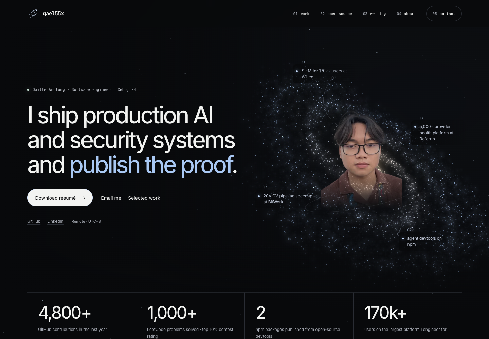
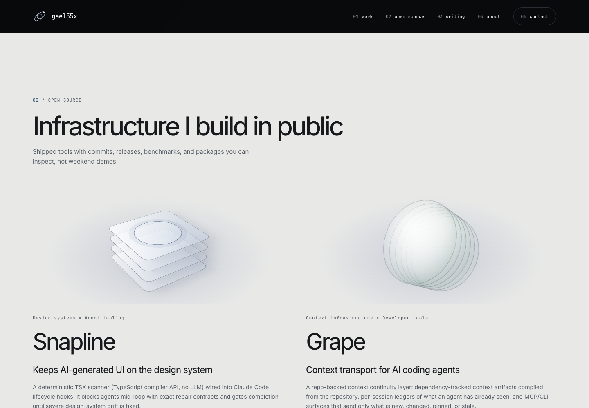

# Galaxy redesign

The direction combines restrained product typography with a cinematic galaxy:
large Inter headlines, white and pale-blue emphasis, open work layouts, fine
constellation paths, and a contrasting pearl-colored open-source section.
Security, healthcare, computer vision, and 3D rendering each have a distinct
engineering illustration. The tools use layered CSS 3D sculptures; writing uses
one lead essay and two supporting essays. The portrait floats inside the galaxy
rather than sitting in a boxed card.

All original portfolio wording, links, dates, and existing project data are
preserved. The separately requested Superfast3D engagement is appended, with the
United Kingdom location confirmed by the user.

## Real 3D and hover stars

`components/SpaceHero.jsx` lazily imports `lib/spaceScene.js` while the hero is
visible and motion is allowed. Three.js renders 14,000 seeded stars in three
spiral arms, a soft dust layer, a luminous core, and distant stars. The dust and
stars share geometry, which is released once during cleanup. Pointer movement
changes the viewing angle and pushes nearby particles away from the cursor.
Leaving restores their positions. Scrolling shifts the galaxy through depth.
Rendering eases to a stop instead of running an idle animation loop.

`components/SpaceBackdrop.jsx` server renders 90 decorative SVG stars. Its
bounded pointer effect repels stars within 130 pixels and smoothly returns them
when the pointer leaves. It uses one scheduled frame at a time and stops once
settled. Motion preferences and document visibility cancel movement and restore
the static stars. Touch input does not trigger repulsion.

Work, tools, and writing use bounded CSS perspective through
`components/SpatialSurface.jsx`. Tool sculpture layers also separate on hover.
Reduced motion keeps surfaces stable. Links and native disclosures retain
keyboard operation. All content remains available without JavaScript; a static
galaxy image replaces WebGL for reduced motion or rendering failure. The
existing interactive Badge Guru study is retained.

## Assets

`public/assets/space/galaxy.webp` is rendered from the same seeded procedural
geometry by `npm run render:galaxy`. It is the static fallback, not an AI-generated
galaxy image.

`public/assets/space/portrait-cutout.webp` is an optimized transparent portrait
asset, generated with the built-in imagegen tool from the existing portrait.
The full-resolution generated source is
`docs/design/assets/portrait-cutout-source.png`; the original photograph remains
unchanged at `public/assets/portrait.jpg`. No API-key workflow was used.

Final portrait prompt:

> Use case: background-extraction. Asset type: transparent portrait cutout for Gaille's personal 3D galaxy portfolio. Edit target: the attached existing portrait. Primary request: remove only the blue sky, buildings, background people and environment, retaining exactly the photographed person (Gaille), his face, glasses, loose hair strands, neck, brown shirt and colored lanyard. Keep his identity, facial features, expression, pose, skin texture, clothing, original lighting and camera perspective unchanged. Clean natural edge around hair, realistic photographed cutout. Framing: crop away the excess empty sky at top so the existing head and shoulders fill the image; retain all available shoulder area and the existing shirt to bottom. Constraints: genuinely transparent background with alpha, no new background, no stars, no relighting, no retouching or beautification, no reconstructed or altered face, no new clothes, no text, no watermark.

## Superfast3D addition

Production URL: <https://www.superfast3d.com/>. Its live page identifies it as a
3D logo generator with live preview and downloadable renders. The Brandinghaven
project conversation links that domain. The user confirmed a separate UK client
engagement and supplied the leadership, Blender scripting, delivery, and $1,000
USD per month compute savings claims. Those outcomes are self-reported; the live
website does not independently verify the savings. Relevant WhatsApp context
supports direction of the rendering team and the planned move toward browser
previews and a Next.js standard rendering flow, with Blender retained for premium
exports. Private chat screenshots, contact details, and operational information
are excluded from the repository.

## Verification

AST comparisons confirm the original JSX wording is preserved, including text
moved into the constellation layout. Existing data files are unchanged and the
first three employment records match `origin/main` exactly.

`npm run test:space` checks actual shader rendering, pointer response, no idle GPU
rendering, background star repulsion and return, work/tool/writing perspective,
resource release outside the viewport, context-loss fallback, and reduced motion.
The full production browser suite checks nine widths from 320 to 1920 pixels,
keyboard operation, native disclosures, touch, accessibility, 200% text sizing,
no-JavaScript content, résumé download, metadata and 404 routing. Reports and
screenshots are written under `/tmp/portfolio-browser-check` and
`/tmp/portfolio-space-check`.

Final checks passed: production build, ESLint, Prettier, Snapline, the badge scene
suite, the star interaction suite, and the full browser suite. All nine tested
widths passed with no horizontal overflow or automated accessibility violations,
including the enlarged-text, reduced-motion, no-JavaScript and WebGL-failure checks.

