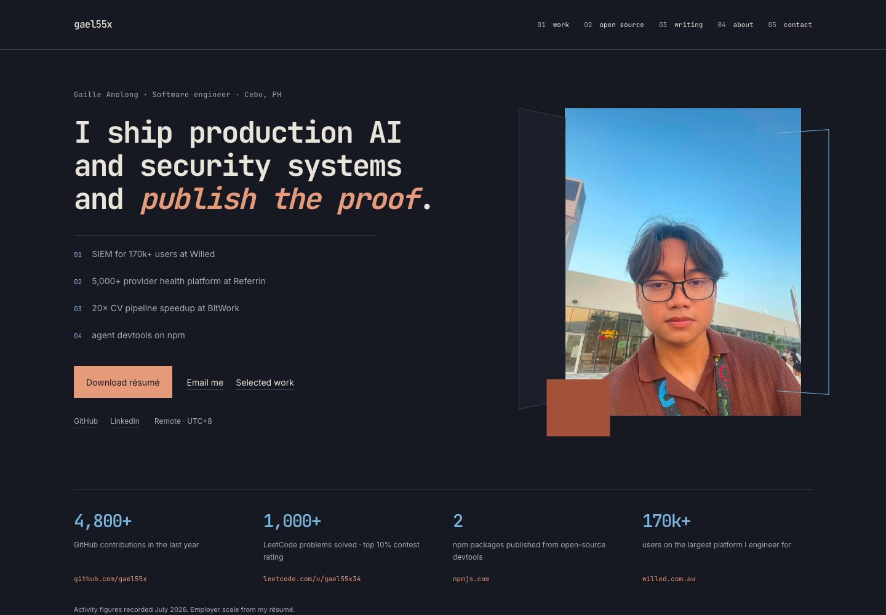
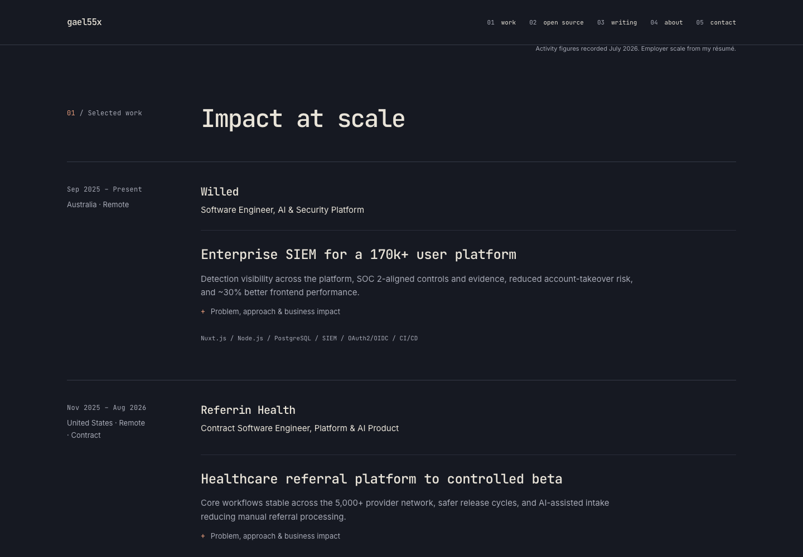
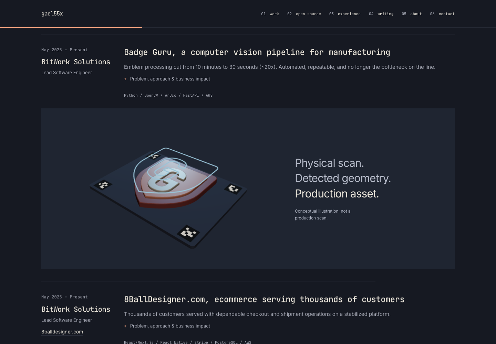
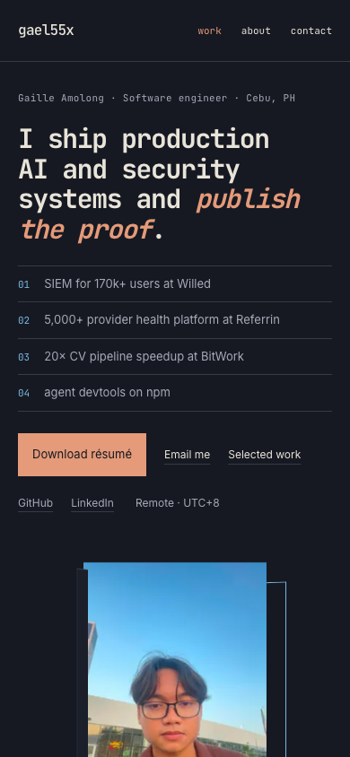
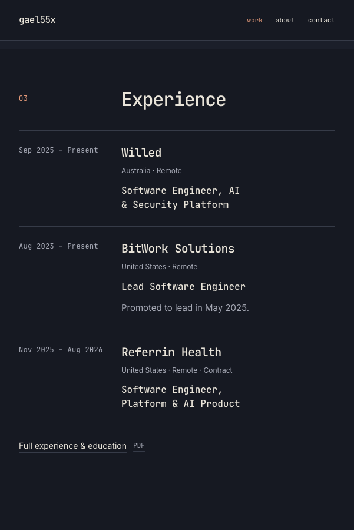
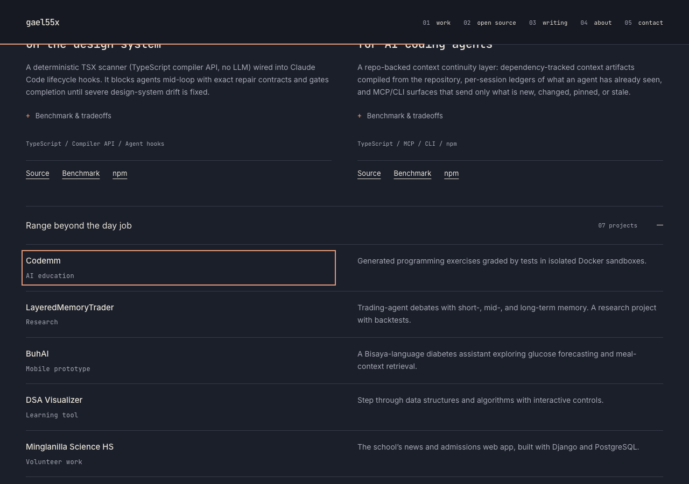

# Final portfolio validation

Reviewed 15 September 2026 against `main` at
`44155ffd8229cd5600bb2ce55264c164342e0fab`. The branch contains one integrated
portfolio change. No merge or production deployment was performed.

## Runtime and browser checks

- Clean `npm ci --ignore-scripts`; production `npm run build`.
- `npm run lint`, `npm run format:check`, and `npm run test:scene`.
- Knip: no unused files, exports, or dependencies reported. The existing Snapline
  hook dependency is the only documented exclusion; no application source is ignored.
- Snapline: zero configured design-system violations.
- `npm audit`: zero reported vulnerabilities, including development dependencies.
- `git diff --check` and complete source/configuration/asset diff review.
- Production Playwright checks in installed Chrome; no unexpected page errors.

| Viewport     | Size        | Horizontal overflow | axe A/AA violations |
| ------------ | ----------- | ------------------- | ------------------- |
| Desktop      | 1440 × 1000 | None                | 0                   |
| Laptop       | 1280 × 800  | None                | 0                   |
| Tablet       | 768 × 1024  | None                | 0                   |
| Mobile       | 390 × 844   | None                | 0                   |
| Small mobile | 320 × 740   | None                | 0                   |
| Small tablet | 601 × 900   | None                | 0                   |
| Breakpoint   | 961 × 900   | None                | 0                   |
| Wide desktop | 1920 × 1080 | None                | 0                   |

Checks cover the hero, work, open source, archive, experience, writing, about and
contact. They verify real font rendering, first-screen actions, decoded images,
all internal anchors, sticky-heading clearance, keyboard skip link, every native
disclosure, expanded-content overflow, and visible content without JavaScript.
The résumé, favicon, share image, robots, sitemap, canonical and 404 recovery work.
200% text reflows without horizontal scrolling.

Interaction checks exercise actual canvas pixels, not just the presence of a button:

- Hover activates the scene; pointer movement eases the view without a click.
  WebGL frame counts verify multiple settling frames and zero rendering once idle.
- Leaving during easing releases the renderer and canvas; Enter activates and rotates it.
- Repeated touch rotates the existing scene instead of recreating it; an outside
  touch releases it without relying on button focus.
- A deliberately held scene request leaves the poster visible while loading.
- WebGL failure and context loss return to the static illustration.
- Reduced motion disables portrait tilt, scroll entrance and automatic hover loading.
- Scrolling changes the native progress line and badge entrance without loading WebGL.
- Native disclosure opening/closing reaches its full/closed height; reduced motion
  disables disclosure and section-heading transitions. Archive links retain their full
  keyboard focus outline during the normal-motion disclosure treatment.
- The optional scene chunks are absent from initial page requests.

These are desktop-browser emulations, not a physical iPhone/Android or assistive
technology certification. Local tests also exclude the Vercel-only analytics script.

## Performance

Local mobile Lighthouse 12.8.2, simulated throttling, production builds:

| Metric                            | Original main | Final  |
| --------------------------------- | ------------- | ------ |
| Performance                       | 94            | 97     |
| Accessibility                     | 96            | 100    |
| Best practices                    | 96            | 100    |
| SEO                               | 100           | 100    |
| First contentful paint            | 0.8 s         | 0.8 s  |
| Largest contentful paint          | 2.9 s         | 2.5 s  |
| Total blocking time               | 40 ms         | 90 ms  |
| Cumulative layout shift           | 0             | 0      |
| First-load JavaScript, Next build | 138 kB        | 110 kB |

The optional 3D chunks total approximately 135 KiB gzip when activated. No textures,
model downloads, shadows or continuous animation loop. DPR is capped at 1.5 and
pointer movement uses frame-time smoothing with one pending frame and stops once settled. Its cost is opt-in on touch
and reduced motion; a fine-pointer hover loads it on desktop.

Earlier runs of the refined design scored 97–98, with 30–90ms blocking time. The
table shows the last delivery run. These are lab measurements, not field Core Web
Vitals or measured INP.
Results vary with machine load and cache state. Native scroll timelines are a
progressive enhancement with a static fallback; see [MDN's timeline reference](https://developer.mozilla.org/en-US/docs/Web/CSS/Reference/Properties/animation-timeline).

## Independent review

Claude Fable 5.1 reviewed a bounded copy of portfolio code, original and revised
screenshots, and the public benchmark evidence through the owner's Claude Max
integration, with explicit authorization and read-only tools.

- First review rejected the early dark prototype (5.5/10): the original identity
  was missing. The final direction restores the original voice, mono type,
  numbered ledger, portrait depth, proof band, testimonial and credentials.
- Second review found no P0, but three P1 issues: repeated touch reload, an opaque
  loading canvas, and inconsistent section numbering. All were fixed and tested.
- Important polish findings were addressed: headline measure, original work order,
  compact employment, tablet proof columns, readable notes, résumé-link behavior,
  promotion metadata, dead CSS and removal of Tailwind's unused build layer.
- Benchmark caveats were verified against the public sources. The initial concern
  came from missing evidence in the first review bundle; no fabricated metric was added.

The final Fable review judged the portfolio ready for one PR to main, with no P0/P1
or material regression. It scored every category 8 except brand distinctiveness
at 7.5. The lead score below differs on that subjective criterion; this is not a
unanimous 8 across reviewers. A final integration pass also aligned the favicon
with the slate/clay palette and addressed its Safari observation: an active scene
now disposes on outside pointer-down or pointer cancellation, without depending
on a tapped button receiving focus.

A bounded Fable follow-up reviewed the final transition additions. It found horizontal
clipping of archive focus rings and a possible margin jump in native disclosures.
Changed the content pseudo-element to clip vertically only and use a flow-root,
and added a keyboard-focus screenshot and geometry/transition checks. The follow-up
confirmed the section-entry and button transitions and the outside-touch release.
No further visual direction or additional effects were introduced.

The later hover-smoothing review caught a frame-clock ordering bug during continuous
pointer input. A controlled-clock check reproduced the backward movement, then
verified the correction: use elapsed frame time without restarting on every input.
That check now runs against the actual scene module with real Three geometry and a
renderer spy; it also checks exact settling, one pending frame and cancellation.
The browser suite exercises a continuous pointer sweep and counts actual WebGL
frames to verify that rendering stops when idle.
Fable's follow-up confirmed the corrected motion was ready to include. Its additional
test suggestion now verifies that the badge follows during the sweep, rather than
waiting for the pointer to stop.

The fixed mobile hire overlay and live clock were deliberately not restored: the
visible contact link, normal-flow actions, location and timezone cover their useful
information without an overlay or recurring timer.

## Content and link limits

- Employer metrics are the owner's existing claims, explicitly labeled self-reported.
  Snapline and Grape benchmark scope, dates and tradeoffs link to public methodology.
- Referrin ends August 2026 on the original site; the supplied PDF says Present.
  The page retains the original site date and the PDF remains byte-for-byte unchanged.
  Correcting that factual discrepancy requires the owner's answer.
- The school project's old domain did not resolve and its old public repository
  returned 404. The archive retains the project without an unavailable link.
- Public GitHub project/methodology URLs, Willed, 8BallDesigner and DSA Visualizer
  returned 200. Medium, LeetCode and npm returned 403 to automated requests, and
  LinkedIn returned 999. Those original URLs are retained; their availability was
  not certified by this automated check.

## Final design rubric

Lead review scores reflect the rendered result and verified behavior, not a claim
that a Lighthouse score measures design quality.

| Area                    | Score / 10 | Evidence / ceiling                                                         |
| ----------------------- | ---------- | -------------------------------------------------------------------------- |
| First impression        | 8          | Original specific headline, visible role/actions, real portrait            |
| Employer friendliness   | 8          | Work order matches positioning; compact employment and résumé              |
| Information hierarchy   | 8.5        | Matching chapters, concise summaries, optional technical depth             |
| Visual design           | 8          | Consistent slate, clay, blue, grid and section rhythm                      |
| Typography              | 8          | Original mono identity; controlled headline measure; legible notes         |
| Brand distinctiveness   | 8          | Owned photography, spatial portrait, custom G badge, Cebu voice            |
| Project storytelling    | 8          | Problem, approach, impact and evidence without invented details            |
| Engineering credibility | 8.5        | Public tools, scoped benchmarks, professional ownership                    |
| Mobile UX               | 8          | Eight widths, repeated tap, no overlay/overflow; long original content     |
| Accessibility           | 8.5        | Keyboard, contrast, no-JS, 200% text, reduced motion; no AT certification  |
| Performance             | 8          | 97–98 lab scores, zero CLS, 110 kB initial JS; optional WebGL cost remains |
| Motion design           | 8          | Hover/touch/keyboard parity and restrained scroll feedback                 |
| Maintainability         | 8.5        | One custom client island, native disclosures/CSS, explicit GPU disposal    |

## Visual evidence

Screenshots are from the final production build. Most static layout captures use
reduced motion to make comparison repeatable; the 3D capture exercises normal motion.

